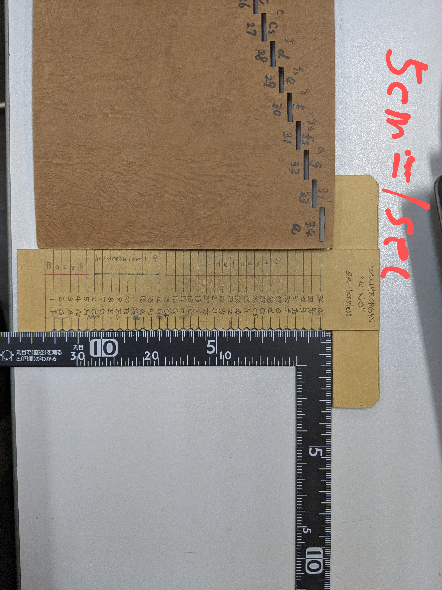

# Street Organ Roll Book Maker

【未完成】

MIDIデータを解析して、
手回しオルガン用のロール・ブックを自動作成します。


## 1. Install

```bash
$ cd ~
$ python3 -m env1
$ cd env1
$ . ./bin/activate
(env1)$ git clone git@github.com:ytani01/StreetOrgan.git
(env1)$ ./StreetOrgan/install.sh
```

## 2. start server

```bash
$ boot-storgan.sh
```

## 3. connect from browser

1. URL: http://hostname:10081/storgan/
1. select a MIDI file
1. download SVG file


## 9. command line usage

```bash
$ Storgan -h
$ Storgan SUB_COMMAND -h
```


## A. 手回しオルガン用ロール・ブック

### A.1 基本

* 右から左
* 34音階、低音部で、一部半音がない
* D#がない
* 1秒 = 約5cm




## B. Reference

* [てまわしオルガン キノ(紀あさ)](http://www.temawashi.org/)
